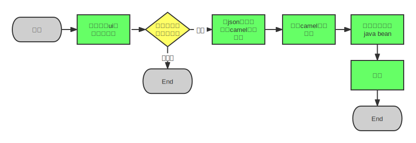
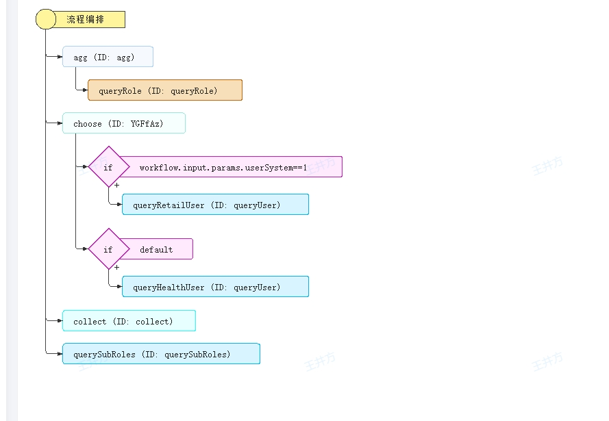
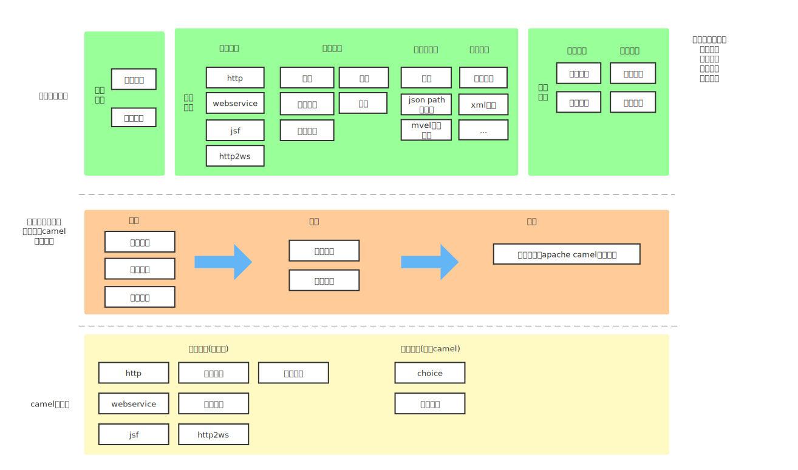

# 设计目标
将不同类型的接口复合形成一个新的接口   


整体流程图如下：

整体流程是用户发起http请求，然后经过一系列的并行、串行任务后返回调用结果。整体是顺序执行的，然后个别子任务间可以并行执行或者按照步骤跳过某些步骤的执行。有点类似与编程

需要具备如下能力：
1. 原子能力：http调用、webservice调用、jsf调用、其他调用   
2.  编程能力：并行执行、分支判断、循环执行、异常处理等   
3.  参数映射：http输入参数需要可以映射到不同的步骤里，每个步骤执行的入参也可以作为下一个步骤的出参，参数映射支持常量、json path表达式、mvel脚本      
4. 参数加工：入参做一些简单的加工   

# 现有的设计思路

1. 前端通过界面编排形成流程配置，如下图所示：前端通过工具形成代码逻辑图

目前配置是基于json配置来做的，主要考虑到前端编辑json比较方便，且json比较容易扩展

2. 前端将json传到后端，后端会校验json的有效性
3. 将json配置转换为[apache camel](https://camel.apache.org/)配置文件，camel本身是用来做流程编排的，接口编排的最终目标是转换为camel配置文件，然后复用camel的执行引擎来执行整个流程。   
举例说明：
```xml
<route xmlns="http://camel.apache.org/schema/spring">
    <from uri="direct:start"/>
    <multicast>
        <bean beanType="com.jd.workflow.entity.CamelStepBean" >
          {"type":"http",...}
        </bean>
    </multicast>
    <choice>
        <when>
            <mvel>steps.step1.input.params.id==1</mvel>
            <bean beanType="com.jd.workflow.entity.CamelStepBean" >
              {"type":"http2ws",...}
            </bean>
        </when>
        <otherwise></otherwise>
    </choice>
</route>
```
如上图所示，camel有multicast、choice、bean等基本节点，分别对应并行执行、选择、自定义java bean。camel通过自定义java bean来做任意复杂的扩展。            
我们只要定义一个json配置文件，然后将配置文件转换为camel的xml配置文件，即可完成整个流程编排设计。  不同步骤的具体转换规则可以参考下面每个步骤的说明。

4. 加载camel文件，初始化java bean: camel支持步骤编排，但是步骤需要通过java bean来进行扩展，这一步会将自己定义的java bean加载到内存里供camel使用  

代码整体架构图如下：


# 流程描述
整体采用json描述，前端设计的结果即为这个json，后端通过解析这个json配置生成camel xml文件，然后再用camel引擎加载 xml配置文件并执行。   
 结构定义如下：
 ```json
{
   input:{// 定义输入结构
	headers:List<JsonType>,
    "body": List<JsonType>
   },
   output:{ // 定义输入结构，同http接口管理
	headers:xx,
	body:xx
   },
   failOutput:{// 执行失败后的输出结果，同http接口管理
    headers:xx,
	body:xx
   },
   tasks:Array<Step>,//任务定义
   taskDef:{
    timeout:10000// 整体任务超时时间
   }
}
```
Step对应执行步骤，分为原子步骤和流程控制步骤，原子步骤主要是指：http、webservice、jsf，控制步骤指的是：分支、循环、并行处理、异常处理
## 不同Step的结构

## 普通步骤
普通步骤包括http、webservice以及数据转换步骤
### http

```json
{
  "id": "xx",
  "type":"http",
  "entityId": 123,// 方法id
  "input":{
    "method":"GET|POST|OPTIONS|...",
	"url":"/user/{type}/{id}",    // {id}表示路径参数，需要在path属性里体现
	"path":Array<SimpleJsonType>, // path参数里只有url里存在占位符的参数，如{type}
	 params:Array<SimpleJsonType>,
  	 headers:Array<SimpleJsonType>,
     "preProcess": "", //预处理脚本
     "script": "", //处理脚本
	 reqType:"form|json",
	 body:Array<JsonType>
  },
  "env": "", //调用环境
  "endpointUrl": [""], //调用环境对应的接口地址列表
  successCondition:"response.code==0",// 本次请求成功的条件，是mvel表达式
  "taskDef": {
    "timeout": 1000,
    "fallbackStrategy": "stop|continue",//失败策略 继续活着停止
    "fallback": {} // 失败后的返回值
  },
  output:{
    headers:Array<SimpleJsonType>,
	body:Array<JsonType>,
    "script": ""// 转换脚本
  }
}
```
http步骤里包含了http步骤的要素，对应的camel描述节点为：
```xml
<bean beanType="com.jd.workflow.flow.core.camel.CamelStepBean" customId="true"
                          id="queryUser">
                        <description>{"id":"queryUser","type":"http","key":null,"input":{"url":"/healthUsers","method":"GET","reqType":"json","params":[{"name":"roleName","value":"${workflow.input.params.roleName}","type":"string"}],"headers":null,"path":null,"body":null,"script":null,"preProcess":null},"output":null,"env":null,"endpointUrl":["http://jap-mock-data.jd.local"],"successCondition":null,"taskDef":null}</description>
</bean>
```

### webservice
```json
{
  "id": "xx",
  "type":"http2ws",  
  "input":{
    "url": "", // webservice调用路径
     "header": Array<SimpleJsonType>
	 body:Array<JsonType> // type为json的时候只有1条，为form的时候可以有多条

  },
  "opName": "",//操作名称
  "env": "", //调用环境
  "entityId": "", //方法id
  "endpointUrl": [""], //调用环境对应的接口地址列表
  "taskDef": {
    "timeout": 1000 // 超时时间
  },
  output:{
    headers:Array<SimpleJsonType>,
	body:Array<JsonType>,
    "script": ""// 转换脚本
  }
}
```
转换为camel步骤的节点为：
```xml
<bean beanType="com.jd.workflow.flow.core.camel.CamelStepBean" customId="true"
                 id="queryRole">
               <description>{"id":"queryRole","type":"http2ws","key":null,"entityId":null,"opName":"queryRole","endpointUrl":["http://127.0.0.1:7001/FullTypedWebService"],"url":"","taskDef":null,"successCondition":null,"input":{"schemaType":{"name":"Envelope","namespacePrefix":"soapenv","attrs":{"xmlns:soapenv":"http://schemas.xmlsoap.org/soap/envelope/","xmlns:ser":"http://service.workflow.jd.com/"},"type":"object","children":[{"name":"Header","namespacePrefix":"soapenv","type":"object","children":[]},{"name":"Body","namespacePrefix":"soapenv","type":"object","children":[{"name":"queryRole","namespacePrefix":"ser","type":"object","children":[{"name":"roleName","value":"${workflow.input.params.roleName}","type":"string"}]}]}]},"header":null,"body":null},"output":{"schemaType":{"name":"Envelope","namespacePrefix":"soapenv","attrs":{"xmlns:soapenv":"http://schemas.xmlsoap.org/soap/envelope/","xmlns:ser":"http://service.workflow.jd.com/"},"type":"object","children":[{"name":"Header","namespacePrefix":"soapenv","type":"object","children":[]},{"name":"Body","namespacePrefix":"soapenv","type":"object","children":[{"name":"queryRoleResponse","namespacePrefix":"ser","type":"object","children":[{"name":"return","type":"object","children":[{"name":"createBy","type":"string"},{"name":"createDate","type":"string"},{"name":"id","type":"long"},{"name":"level","type":"string"},{"name":"roleDesc","type":"string"},{"name":"roleName","type":"string"}]}]}]}]},"header":null,"body":null}}</description>
</bean>
```

### 转换步骤
```json
{
  "id": "xx",
  "type":"transform",     
  output:{
	  body:Array<JsonType>,
    "script": ""// 转换脚本
  }
}
```
转换可以分为配置转换以及mvel脚本转换，针对mvel脚本，上下文暴露出output变量，结构如下：
```java
class HttpOutput{
  Map<String,Object> headers;
  Object body;
}
```
通过对output的headers、body属性赋值完成值收集功能，另外，由于步骤具有步骤id，所以后续可以通过**steps.xx.output.body**、 **steps.xx.output.headers**获取到当前转换步骤的执行结果。
```js
output.headers = {
  "token":workflow.input.headers.token
}
output.body = {
  "id":workflow.input.params.id,
  "name":steps.step1.output.body
}
```

配置映射是通过json配置来完成整个映射，比如上面的脚本映射，通过等价的配置可以实现同样的效果：
```json
{
  "headers":{
    "name":"token",
    "type":"string",
    "exprType":"script",
    "value":"workflow.input.headers.token"
  },
  "body":[{
      "type":"object",
      "children":[
        {
          "name":"id",
          "type":"string",
          "exprType":"script",
          "value":"workflow.input.params.id"
        },
        {
          "name":"name",
          "type":"string",
          "exprType":"script",
          "value":"steps.step1.output.body"
        }  
      ]

    }]
}
```
在执行时，会将json描述提取为map或者数组类型，然后再做一下映射，具体细节可以参考下面的参数映射


## 聚合步骤
聚合步骤包括choose和multicast并行步骤

### choose步骤
```json
{
  "id": "xx",
  type:"choose",
  children:[
   {
     when:"",//表达式
     "id": "",
	 children:Array<Step> // 匹配后执行此步骤
   },
   {
     when:'',//表达式
     "id": "",
	 children:Array<Step> // 匹配后执行此步骤
   },
   { // 默认执行的逻辑
     otherwise:'',
     "id": "",
	 children:Array<Step>
   }
  ]
}
```
转换后的camel配置文件等于
```xml
<choice customId="true" id="queryUserList">
    <when id="分支1">
        <mvel customId="true" id="queryUserList_condition0">
            Object stepContext = exchange.getProperty("stepContext");
            Object workflow = stepContext.buildEnv().get("workflow");
            Map steps = stepContext.steps;workflow.input.params.userSystem==1</mvel>
        <bean beanType="com.jd.workflow.flow.core.camel.CamelStepBean" customId="true"
              id="queryUser">
            <description>{"id":"queryUser","type":"http",...}</description>
        </bean>
    </when>
    <otherwise customId="true" id="otherwise">
        <bean beanType="com.jd.workflow.flow.core.camel.CamelStepBean" customId="true"
              id="queryUser">
            <description>{"id":"queryUser","type":"http",...}</description>
        </bean>
    </otherwise>
</choice>
```

### 聚合步骤
```json
{
  "id": "xx",
  "type":"multicast",   
  "children":Array<Step>,  
  output:{
	   body:Array<JsonType>,
    "script": ""// 转换脚本
  }
}
```
聚合步骤用来将多个子步骤聚合成一个步骤，执行完成后通过output来收集数据，output数据收集的过程和转换步骤一致   
转换后的camel配置文件如下：
```xml
<multicast parallelProcessing="true" stopOnException="true">
   <bean beanType="com.jd.workflow.flow.core.camel.CamelStepBean" customId="true"
         id="queryRole">
       <description>{"id":"queryRole","type":"http2ws",...}}</description>
   </bean>
   <bean beanType="com.jd.workflow.flow.core.camel.CamelStepBean" customId="true"
         id="queryRole">
       <description>{"id":"queryRole","type":"http",...}}</description>
   </bean>
</multicast>  
```


# 核心接口
依据执行流程图，配置有经过如下流程：解析json配置->将json转换为camel配置文件 ->加载自定义bean   

相应的，后端主要需要抽象出4个接口：
1. 步骤描述定义接口metadata： 用来定义不同的步骤配置
2. 步骤解析 & 校验 ： 用来解析步骤定义并且做校验
3. 步骤转换为camel定义接口：将每个步骤的json配置转换为camel配置文件
4. 自定义java bean接口：用来定义普通步骤

## 步骤定义接口metadata
步骤定义对应不同类型的步骤，所有的步骤定义都需要继承这个类
```java
public abstract class StepMetadata {
    protected String id; // 步骤id
    protected String type; // 步骤类型  
    public void init(){} // 步骤初始化方法，用来初始化步骤
}
```
StepMetadata有HttpStepMetadata、WebServiceStepMetadata、JsfStepMetadata、ChoiceStepMetadata等实现。举例说明，如下图HttpStepMetadata基本与http的json描述一致，通过json解析，就可以直接将json描述转换为HttpStepMetadata
```java
@Data
public class HttpStepMetadata extends FallbackStepMetadata {
    Input input;
    Output output;
    /**
     * 调用环境
     */
    protected String env;
    /**
     * 要访问的实际地址
     */
    protected List<String> endpointUrl;
    CustomMvelExpression successCondition;

    TaskDefinition taskDef;

    @Data
    public static class Input{
        String url;
        String method;
        String reqType;
        List<SimpleJsonType> params;
        List<SimpleJsonType> headers;
        List<SimpleJsonType> path;
        List<JsonType> body;
        CustomMvelExpression script;
        CustomMvelExpression preProcess;

    }
    @Data
    public static class Output{

        List<SimpleJsonType> headers;
        List<JsonType> body;
        CustomMvelExpression script;
    }
}
```

## 步骤解析 & 校验接口
步骤解析接口用来解析步骤定义,得到步骤定义**StepMetadata**，有3个实现：
* BeanStepDefinition 用来解析普通的自定义步骤
* ChoiceDefinition  用来解析选择步骤
* MulticastDefinition 用来解析并行步骤      
这样设计的原因： Choice、Multicast步骤有子步骤，需要递归解析，而普通的java步骤直接将json转换为StepMetadata即可   

```java
public interface StepDefinition extends RouteStepBuilder {
    String getId(); // 步骤id
    void setId(String id);// 设置步骤id
    public void parseMetadata(Map<String,Object> config); // 解析步骤定义
    public StepMetadata getMetadata(); // 获取步骤定义
    public void setMetadata(StepMetadata metadata); // 设置步骤定义
    public Map<String,Object> getConfig(); // 获取原始配置
    public String getType(); // 获取步骤类型
    /**
     * 获取子步骤，children可能会出现分支，不同分支的步骤id可以重复
     * @return
     */
    default Map<Integer,List<StepDefinition>> getChildren();

}
```


## 步骤转换为camel定义接口
该接口用来将json描述转换为camel步骤定义，具体转换规则参考上面的每个步骤的定义。
```java
public interface RouteStepBuilder {
    public void build(XNode parent);
}
```
有3个实现：
* BeanStepDefinition 用来转换普通java bean
* ChoiceDefinition  用来转换choose步骤
* MulticastDefinition 用来转换并行步骤    
以转换Bean步骤为例：
```java
public void build(XNode parent) {
    XNode child = XNode.make("bean");
    child.attr("beanType", CamelStepBean.class.getName())
            .attr("customId","true")
            .attr("id",metadata.getId())
            .makeChild("description").markCDATA(true).content(JsonUtils.toJSONString(metadata));
    parent.appendChild(child);
}
```

## 自定义java bean 接口
apache camel支持普通的java bean步骤，可以用来定义任意的逻辑，因此自己规定了一个普通的java bean接口来处理自定义逻辑，任何步骤都需要实现此接口来处理业务逻辑。
```java
public   interface StepProcessor<T extends StepMetadata> {
    /**
     * 初始化参数
     * @param metadata 步骤参数，序列化为json以后的参数,初始化的时候才会被调用
     */
    public void init(T metadata);

    default public Class<T> getMetadataType(){
        return (Class<T>) ((ParameterizedType) getClass().getGenericInterfaces()[0]).getActualTypeArguments()[0];
    }
    /**
     *  步骤执行逻辑,必须设置 必须调用currentStep.setInput  及currentStep.setOutput方法
     * @param  currentStep 步骤执行时的信息，一个步骤包括input和output，分别记录下了步骤的输入和输出信息
     * @param
     * @return
     */
    public void process(Step currentStep);
}
```
**init**方法用来初始化StepMetadata,camel配置加载的时候会被执行，且只会被执行一次。process每次处理都会被执行。

实现一个步骤处理器的步骤如下：
1.  实现StepMetadata,这块用来描述接口
2.  实现StepProcessor, process方法用来处理执行逻辑
3. process方法实现时需要先通过**step.getStepContext()**获取到前面步骤的执行结果，然后调用工具类做参数映射得到当前步骤的入参并执行,参数具体怎么映射可以参考下面的参数映射说明

目前StepProcess有如下实现类：
* HttpStepProcessor http步骤处理器
* Http2WsStepProcessor  webservice步骤处理器
* FallbackStepProcessor 异常处理处理器，相当于try catch，接口执行失败可以有一个fallback
* ExceptionStepProcssor  异常值收集处理器，流程执行异常的话会走到此逻辑
* InputValidateStepProcessor 用来校验流程的入参是否合规


Step是执行步骤,记录了步骤的基本属性：
```java
public class  Step  {
    String id;
    String key;
    Input input; // 步骤执行的实际入参，即脚本映射的实际结果
    Output output; // 步骤执行的实际结果
    StepContext context; // 步骤执行上下文，记录了不同步骤的执行结果
    boolean invoked = false;// 是否执行
    boolean success = true;  // 执行是否成功
    protected Map<String,Object> attrs = new ConcurrentHashMap<>(); //额外的属性，脚本预处理时可以用来临时存储变量
}
```
StepContext是执行上下文，记录了步骤的入参和出参信息
```java
public class StepContext  {
    Map<String,Step> steps = new ConcurrentHashMap<>();
    Map<String,Object> attrs = new ConcurrentHashMap<>();
    WorkflowInput input; // 整体流程的入参
    Output output;  // 整体流程的出参
    StepExecException exception;// 执行异常
}
// 输入信息，可以有不同的实现
public class Input extends AttributeSupport {
    public void error(String message){
        throw new StepValidateException(message);
    }
}
// 步骤输出接口，可以有不同的实现
public abstract class Output extends AttributeSupport {
    Map<String,Object> attrs = new ConcurrentHashMap<>();
    RuntimeException exception;
    boolean success=true;
    Object body;
}
```

# 参数映射
参数映射用来处理接口执行过程中的参数信息，可以用来做值映射以及结果收集。目前参数映射支持**json path表达式**、**mvel脚本** 2种映射方式，两者定位如下：
* json path表达式：用来做简单的参数取值、值拼接，通过json path能够很方便的获取到json里的任意参数，也可以用来做参数拼接，比如 **${workflow.input.params.firstName}-${workflow.input.params.lastName}**,被**${}**包裹的是json表达式，其他的都是常量。
* mvel脚本：用来做参数映射、类型转换以及复杂格式的数据构造，由于可以写代码，因此可以支持任意复杂的数据加工    
为了方便数据加工，对用户暴露**worflow**、**steps** 2个变量用来取值，分别对应Workflow、Workflow#steps 。同时，为了方便临时存储用户加工的数据，提供**workflow.attrs**、**steps.xx.attrs**、**step.xx.input.attrs**、**step.xx.output.attrs** 来临时存储用户加工的信息。
json 描述举例说明：   
这是一个描述，描述了整个结构的参数以及类型
```json
{
  "name":"person",
  "type":"object",
  "children":[{
    "name":"id",
    "value":"${workflow.input.params.id}",
    "exprType":"expr"
    }
    ,{
      "name":"name",
      "value":"${workflow.input.params.name}",
      "exprType":"expr"
      }
    ,{
      "name":"age",
      "value":"var age = workflow.input.params.age;age;",
      "exprType":"script"
    }
  ]
}
```
在执行的时候，会将描述转换为map或者array，然后按层级去做value映射
```js
{
  "person":{
    "id":"${workflow.input.params.id}",
    "name":"${workflow.input.params.name}",
    "age":CustomMvelExpression // 这里会事先将mvel脚本编译一下
  }
}
```


mvel脚本用来做请求值预处理、响应值加工以及参数校验，我们分开来说
## 请求值预处理
预处理脚本用来加工数据以及参数校验：
1. 校验失败通过Workflow#error方法或者Input#error方法来返回错误
2. Workflow、Step、Input、Output都有attrs属性，用来临时存储加工后的数据
```java
if(workflow.input.params.amount < 0){
  workflow.error("校验失败:梳理不可为空");
}
workflow.attr("total",workflow.input.params.amount*workflow.input.params.price)

```
在映射里可以通过**workflow.attrs.total**获取变量

## 入参 & 出参映射
在入参里提供input变量，可以这样做映射：
```js
input.headers = {
  "token":"x-ss"
}
input.body = {
  "sid":workflow.input.params.id
}
```
出参也类似：
```js
output.headers = {
  "token":"x-ss"
}
output.body = {
  "sid":workflow.input.params.id
}
```
## 参数转换
提供工具函数来加工数据，目前支持json解析、xml解析、日期转换、类型转换，详情参考：[数据加工](http://doc.jd.com/data-flow/flow-docs/component/components/script.html#%E6%95%B0%E6%8D%AE%E5%8A%A0%E5%B7%A5%E5%87%BD%E6%95%B0)
