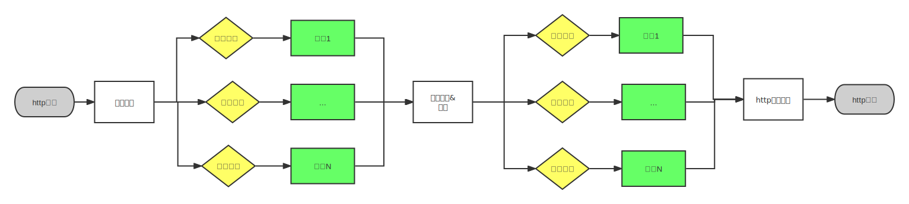
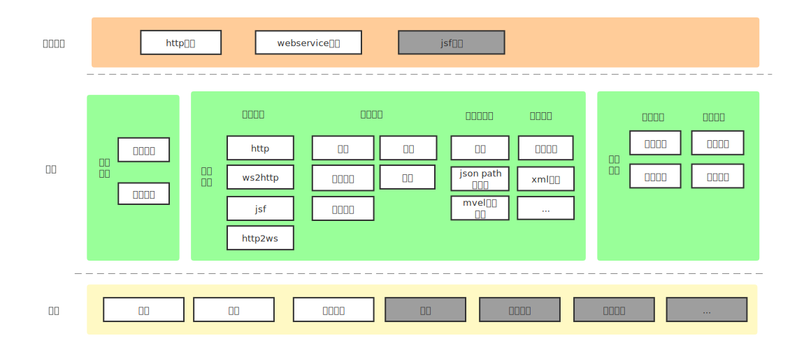

# 什么是服务编排？   

服务编排主要基于现有的业务方法使用在线配置的方式快速的生成一个聚合方法。      
特点： **在线API设计**、**在线测试**、**快速开发**、**一键上线**    

举例说明：      
>订单详情页面需要展示订单信息、商品信息和用户信息。   
  可通过配置的方式生成一个接口并行调用订单详情接口、商品信息接口和用户信息接口，再从这3个接口的返回结果里提取需要的字段返回给前端页面。   

# 适用场景
**前端**    
1. 一个页面调用多个接口时，可以编排好返回聚合结果，提高页面数据的加载速度   
2. 移动设备计算能力有限，可以把数据计算或业务处理逻辑放到服务端完成，加快页面响应       

**后端**  
1. 替换应用层的聚合接口，减少应用层的胶水代码
2. 数据转换和映射
3. 协议转换：webservice、jsf前端不好直接调用，可以通过工具做协议转换

# 整体流程

# 功能图

